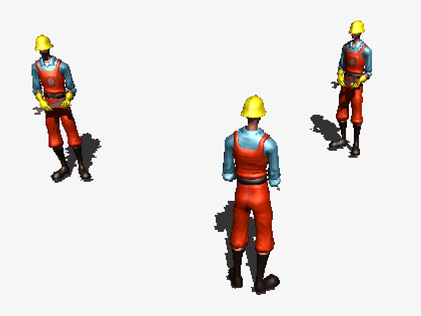

HFT-Unity Character Example
===========================

This is a sample Unity3D game for the [HappyFunTimes party games system](http://greggman.github.io/HappyFunTimes).

It simply shows spawning 3d characters in unity and controlling them through happyfuntimes.

Cloning
-------

Prerequisites

*   node.js http://nodejs.org
*   bower http://bower.io
*   happyfuntimes http://greggman.github.io/HappyFunTimes
*   hft-cli http://github.com/greggman/hft-cli

If you clone this you'll need follow the following steps

1.  install happyfuntimes http://greggman.github.io/HappyFunTimes
2.  install hft-cli by typing `sudo npm install -g hft-cli`
3.  clone this repo
4.  After cloning cd to the folder you just cloned into and type `bower install`
5.  edit `package.json` and change the `gameId` to some other id.
6.  set the `gameId` in the example to match the one you set in step 5.
7.  type `hft add` which will add this to happyFunTimes.

